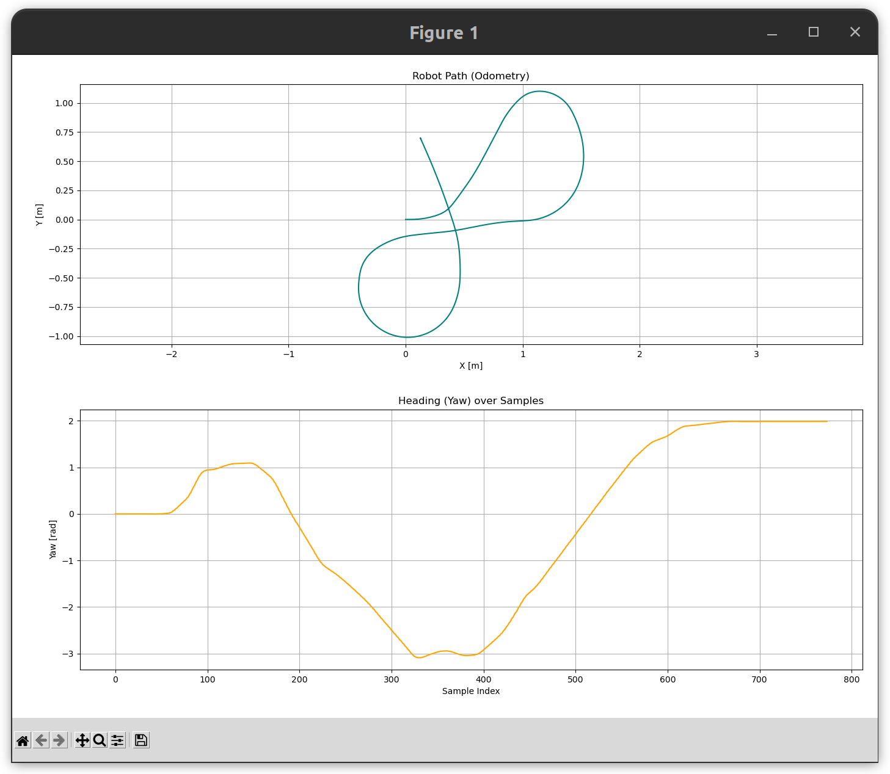

# Lab 1 – Logger Exercise

**Autonomous Systems Course · CRTA Lab, University of Zagreb**

This repository contains a template for the first laboratory exercise. The goal is to implement a ROS 2 node that subscribes to one or more topics and logs the received data to the terminal and/or a file using ROS 2 logging utilities.

---

## Prerequisites

Before you begin, make sure the following are installed on your system:

- **Ubuntu 22.04** (recommended) or a compatible Linux distribution
- **ROS 2 Humble** (or the distro specified by your instructor)
- **Python 3.10+**
- **colcon** build tool

If ROS 2 is not yet installed, follow the official guide:
https://docs.ros.org/en/humble/Installation.html

---

## Creating a ROS 2 Workspace

If you do not already have a workspace, create one with the following commands:

```bash
mkdir -p ~/ros2_ws/src
cd ~/ros2_ws
```

Source your ROS 2 installation (add this to `~/.bashrc` to avoid repeating it):

```bash
source /opt/ros/humble/setup.bash
```

---

## Cloning the Repository

Clone the package into the `src` directory of your workspace:

```bash
cd ~/ros2_ws/src
git clone https://github.com/CRTA-Lab/lab1_logger_exercise.git
```

Your workspace structure should now look like this:

```
ros2_ws/
└── src/
    └── lab1_logger_exercise/
        ├── lab1_logger_exercise/
        ├── resource/
        ├── test/
        ├── package.xml
        ├── setup.cfg
        └── setup.py
```

---

## Installing Dependencies

From the root of your workspace, install any declared dependencies:

```bash
cd ~/ros2_ws
rosdep install --from-paths src --ignore-src -r -y
```

---

## Building the Package

Build the workspace using `colcon`:

```bash
cd ~/ros2_ws
colcon build --symlink-install
```

After a successful build, source the local workspace overlay:

```bash
source install/setup.bash
```

> **Tip:** Add `source ~/ros2_ws/install/setup.bash` to your `~/.bashrc` so you don't have to source it manually every time.

---

## Running the Node

Once built, run the logger node with:

```bash
ros2 run lab1_logger_exercise <node_name>
```

Replace `<node_name>` with the entry point defined in `setup.py` (e.g. `logger_node`).

---

## Task Description

The exercise is split into two parts. Both nodes are provided as templates — your job is to fill in the missing logic marked with `# Fill`.

---

### Part 1 — Logger Node

#### Objective

Implement a ROS 2 node that subscribes to the `/odom` topic and saves the robot's position and orientation to a CSV file.

#### What to implement

- Subscribe to `/odom` (`nav_msgs/msg/Odometry`)
- On every received message, extract:
  - **x** — position along the X axis (`pose.pose.position.x`)
  - **y** — position along the Y axis (`pose.pose.position.y`)
  - **yaw** — heading angle, converted from quaternion to Euler angles
- Append each row to a CSV file in the format:

```
x,y,yaw
1.234,0.567,0.312
...
```

- On node shutdown (`Ctrl+C`), close the CSV file cleanly and display a trajectory plot of the recorded path (x vs y).

#### How to run

**Terminal 1** — start the logger node:

```bash
ros2 run lab1_logger_exercise logger_node
```

**Terminal 2** — play back the provided ROS bag file:

```bash
ros2 bag play <path_to_bag_file>
```

Once the bag file finishes playing, press `Ctrl+C` in Terminal 1 to stop the logger node. A plot of the recorded trajectory will appear automatically.

---

### Part 2 — Path Publisher Node

#### Objective

Implement a ROS 2 node that reads the CSV file saved in Part 1 and publishes the recorded trajectory as a `nav_msgs/msg/Path` message in the `odom` frame.

#### What to implement

- Read the CSV file generated by the logger node
- For each row, create a `geometry_msgs/msg/PoseStamped` with:
  - `header.frame_id = "odom"`
  - `pose.position.x` and `pose.position.y` from the CSV
  - `pose.orientation` converted back from yaw to quaternion
- Publish the full list of poses as a `nav_msgs/msg/Path` on the `/path` topic

#### How to run

Make sure the CSV file from Part 1 exists, then run:

```bash
ros2 run lab1_logger_exercise path_publisher_node
```

To visualise the published path, open **RViz2** in a separate terminal:

```bash
rviz2
```

In RViz2:
1. Set the **Fixed Frame** to `odom`
2. Add a **Path** display and set its topic to `/path`

You should see the recorded trajectory rendered in the `odom` frame.

---

### Acceptance Criteria

**Logger node:**
- Subscribes to `/odom` and writes `x`, `y`, `yaw` rows to a CSV file
- Closes the file and shows a trajectory plot on `Ctrl+C`
  


**Path publisher node:**
- Reads the CSV file and publishes a valid `nav_msgs/msg/Path` on `/path`
- Path is correctly visualised in RViz2 in the `odom` frame

---

### Useful ROS 2 Commands

```bash
# Check that /odom is being published during bag playback
ros2 topic echo /odom

# Verify the path is being published
ros2 topic echo /path

# List all active topics
ros2 topic list
```

---

## Project Structure

| Path | Description |
|------|-------------|
| `lab1_logger_exercise/` | Main Python package containing node source files |
| `resource/` | Package resource marker (required by ament) |
| `test/` | Unit and integration tests |
| `package.xml` | Package metadata and dependencies |
| `setup.py` | Python package build configuration |
| `setup.cfg` | Entry points and install settings |

---

## License

This project is licensed under the **Apache License 2.0**. See [LICENSE](LICENSE) for details.
